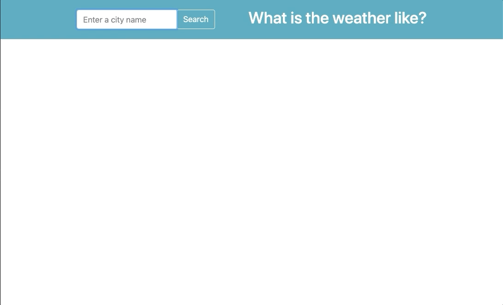

# Weather App
> This app is allowed users to get the current weather for a city specified.



## Installation
Clone the repository

```
$ git clone https://github.com/uyennguyen16900/weather-node.git
```

Go to the repo folder

```
$ cd weather-node
```

Install all modules

```
$ npm install
```

Run the server file

```
$ node
```

Run the [app](https://localhost:3000)


### Get the home page
`/`

### Get the current weather for any city
`/weather`


OpenWeather [API](https://openweathermap.org/api) Documentation
